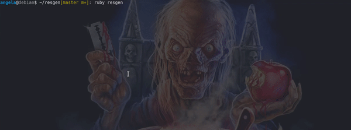

# Resgen: Resume Generator Automation

A Ruby-based application to automate the lengthy steps for writing and dating cover letters and keep track of companies and jobs you've applied to.

Generate PDFs from Libre Office .odt templates on the fly *and* save a copy of the job posting, all without ever having to leave your terminal!

The only thing Resgen doesn't do for you is actually send the resume (but with some minor tweaks, it could do that, too!)



### Zero technical skill required for use
Aside from knowing how to run a command line application, of course.

How it works:

- Initialize Resgen by navigating to it's directory in your terminal and running `ruby resgen`
- Resgen will prompt you for information about your job prospect &amp; even alert you if you've applied there before
- Based on the information you give Resgen, a customized cover letter with the employer name and current date will be generated and merged with your regular resume, straight from .odt templates; no needing to have to create the PDFs by hand any time you want to update it - Resgen does it for you
- Resgen also scrapes the job posting and saves a textual copy (and dates the  file), so you have a point of reference when you're called in for an interview
- Saves a copy of your resume to your preferred destination (for easy upload); also saves a copy alongside the job posting scrape for easy reference when reviewing that particular job's application details
- Generate [Reports](../../wiki/Reports) for weekly, monthly or yearly job applying activity
- [Frequently Asked Questions](../../wiki/FAQ)

## Upgrading
To upgrade from a [previous version](CHANGELOG.md) of Resgen, follow the [Upgrade wiki](../../wiki/Upgrading)

## Compatible Operating Systems (64-bit)
- Linux-based operating systems
- Windows 10 [Install instructions](../../wiki/Windows-Install)
- MacOS Mojave+ [Install instructions](../../wiki/Mac-Install) ([see Catalina issue](https://github.com/mozilla/geckodriver/releases/tag/v0.27.0))

*(It would work on 32-bit too, I just didn't include the needed drivers to support it, if you are using 32-bit, [let me know](../../issues) and support will be added.  If you're unsure whether or not your OS is 64/32-bit, it is probably 64-bit.)*

## Quick install
**Linux/Mac users:** Using [RVM](https://rvm.io/) is *highly* recommended; it allows you to install Ruby in a virtual sense and doesn't rely upon or mess with the Ruby already bundled with your operating system. (no root/sudo required for gem installs, too!)
- Just be sure to use the compatible Ruby version (see Dependencies section):
```bash
curl -sSL https://get.rvm.io | bash -s stable
```
See what verion of Ruby you're running:
```bash
rvm current
```
If you're at least v2.7, you're ready for Resgen!

If you need OS-specific instructions, see the compatible operating systems above for links to detailed steps.
```bash
git clone https://github.com/angela-d/resgen.git && cd resgen && ruby resgen
```

## Dependencies
Companion applications you need installed in order for Resgen to work.

- Ruby v2.7.x
- Ruby gems (typically installed with Ruby, by default)
- Libre Office 7.0.42+
- Firefox/Firefox ESR 91.8+

***

### [Why is Firefox required?](../../wiki/Why-Firefox)

***

## Customizing

The configuration for the application can be found at [config.yml](config.yml); modify the paths according to your environment.

The [template.odt](templates/template.odt) file has examples of the variables you'll need to add to your own cover letter in order for Resgen to automate for you.  If you wish to add more fields, do so by modifying the `resgen` loop in [controller.rb](classes/controller.rb) and featuring the subsequent `[NEW_VARS]` in your cover letter template.

For detailed instructions on adding additional fields, see the [Custom Fields](../../wiki/Custom-Fields) wiki

## Bugs or Issues
Check the [Install Help](../../wiki/install-help) wiki or post an issue on the [bug tracker](../../issues)

## License
GPLv2 only
